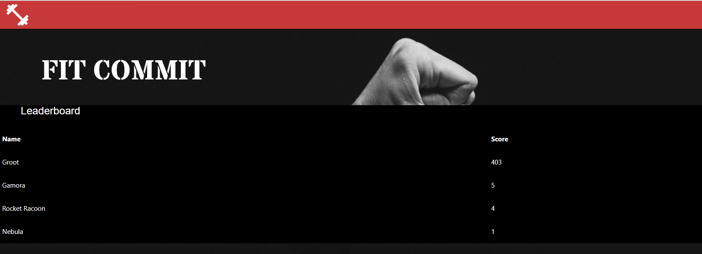

# Fit Commit

# Developer's Profile
<b> Clarisse Bonang </b> 
[GitHub](https://github.com/csbonang)
<b> Michael Callahan </b> 
[GitHub](https://github.com/mcall0147)
<b> Zack Khan </b> 
[GitHub](https://github.com/zack-khan)
<b> David Ludwik </b> 
[GitHub](https://github.com/davidludwik2370)
 
## Description 
-------------------
Welcome to FitCommit!

Fit commit is a handy online fitness application that allows a user to track their fitness.
Once a user signs up and creates an account they can add workouts and track their fitness via a custom fitness score.

Fit commit uses javascript for the frontend, handlebars for the html, node.js for the backend, express to run the server, materialize for the css styling, and sequilize for the database management.

## Table of Content
-------------------
* [Commands](#commands)
* [License](#license)
* [Contributing](#contributing)
* [Questions](#questions)

## Screenshot 
<b>Login Page </b> 

<b>User's Profile Page </b> 

<b>Leaderboard </b> 

## Commands
node seeds/seeds.js 
ndoemon server.js 

## License 
[MIT License](https://opensource.org/licenses/MIT)

## Contributing 
Please notify me if you intend to contribute. 

## Questions 
If you have any questions about the repo, open an issue or contact us directly
at csgbonang@gmail.com. You can find more at <b> Clarisse Bonang </b> 
[GitHub](https://github.com/csbonang)
<b> Michael Callahan </b> 
[GitHub](https://github.com/mcall0147)
<b> Zack Khan </b> 
[GitHub](https://github.com/zack-khan)
<b> David Ludwik </b> 
[GitHub](https://github.com/davidludwik2370) 
        